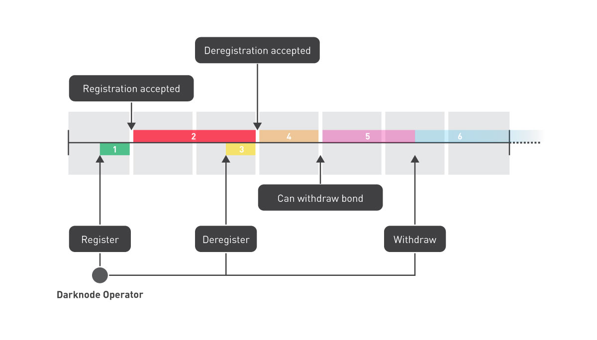

# Darknode Registry

The Darknode Registry is an Ethereum smart contract used to register Darknodes and define the network configuration for the Secure Order Matcher.

## Bond

A *bond* of 100,000REN is required when registering a Darknode. This bond is slashed in half by the [Darknode Slasher](./03-darknode-slasher.md) when a proof of malicious behaviour is produced. The bond prevents malicious adversaries from:

1. registering a large number of Darknodes to gain control over the network, and
2. presenting a false positive in the Secure Order Matcher.

## Epochs

The Darknode Registry partitions time into discrete intervals, called *epochs*. State changes that affect the configuration of the Darknode network are restricted to these discrete intervals, ensuring the stability of the network configuration during the epoch. This cover the (de)registration of Darknodes, as well as the public constants defined by the Darknode Registry (e.g. the *minimumPodSize*).

Epochs are defined by their block number, and their block hash. Any account can trigger the next epoch, but the Darknode Registry prevents epochs from being triggered faster than the *minimumEpochInterval* — measured in block numbers.

## Darknode Address

Darknodes are identified by their *Darknode Address*, an array of 20 bytes generated from an ECDSA private key held by the Darknode that is compatible with Ethereum addresses.

## Darknode Pods

Darknodes are organised into *Darknode Pods* according to a deterministic algorithm based on (a) the list of registered Darknodes, and (b) the block hash of the epoch. This algorithm is executed off-chain by observing (a) and (b) in the Darknode Registry for the epoch of interest. The Darknode Registry stores (a) and (b) for the current, and previous, epoch.

We define:

- _ξ_ to be the epoch.
- _h_ to be the block hash for _ξ_.
- _m_ to be the minimum number of Darknodes in a Darknode Pod for _ξ_.
- _n_ to be the number of registered Darknodes in the Darknode Registry for _ξ_.
- _x_ to be the Darknode at the _x_-th position in the list of registered Darknodes stored in the Darknode Registry for _ξ_.

We compute:

- _p(x)_; the priority of Darknode _x_ during _ξ_. If _p(x) < p(y)_ then _x_ is said to have a higher priority than _y_.
- _q(x)_; the Darknode Pod of the Darknode _x_ during _ξ_.

```
p ← 1
x ← h mod n

for i in 1 .. n do
    p(x) ← 0

for i in 1 .. n do
    while p(x) > 0 do
        x ← x + 1
    p(x) ← p
    q(x) ← p mod (⎣n / m⎦)
    x ← (x + h) mod n
    p ← p + 1
```

Using the list of registered Darknodes for _ξ_, and the block hash for _ξ_, observers will compute the same configuration of Darknode Pods without needing to interact. Darknode Pods define which Darknodes need to collaborate to run the Secure Order Matcher during _ξ_.

## Registration

Before a Darknode is included in a Darknode Pod (e.g. traders and other Darknodes acknowledge it as part of the network of Darknodes that runs the Secure Order Matcher), it must have its Darknode Address registered by a *Darknode operator*. The Darknode operator is the Ethereum account that will receive the fees earned by the Darknode during its operations. The Darknode operator is the only account that can deregister a Darknode, other than the [Darknode Slasher](./03-darknode-slasher.md).

In the diagram below represents a timeline for the registration, deregistration, and refunding, of a Darknode. The grey boxes represent the discrete time intervals, epochs, and the coloured numbers are used to describe the sequence of events.



**(1) Pending Registration**
  The bond is sent to the Darknode Registry and the Darknode is in the *Pending Registration* state until the beginning of the next epoch. The account sending this transaction is consdered to be the Darknode operator.

**(2) Registered**
  The registration is automatically finalised and the Darknode is in the *Registered* state. The Darknode is considered registered until it reaches the deregistered state at (4).

**(3) Pending Deregistration**
  The intent to deregister is sent to the Darknode Registry and the Darknode is in the *Pending Deregistration* state until the beginning of the next epoch. The Darknode is still considered registered until it reaches the deregistered state at (4).

**(4) Deregistered**
  The deregistration is automatically finalised and the Darknode is in the *Deregistered* state.

**(5) Cooling**
  The Darknode is no longer considered active. The bond cannot be refunded until the beginning of the next epoch.

**(6) Refunded**
  The intent to refund is sent to the Darknode Registry and the bond is returned to the Darknode operator. The Darknode is removed from the Darknode Registry and can be regsitered again by any account.