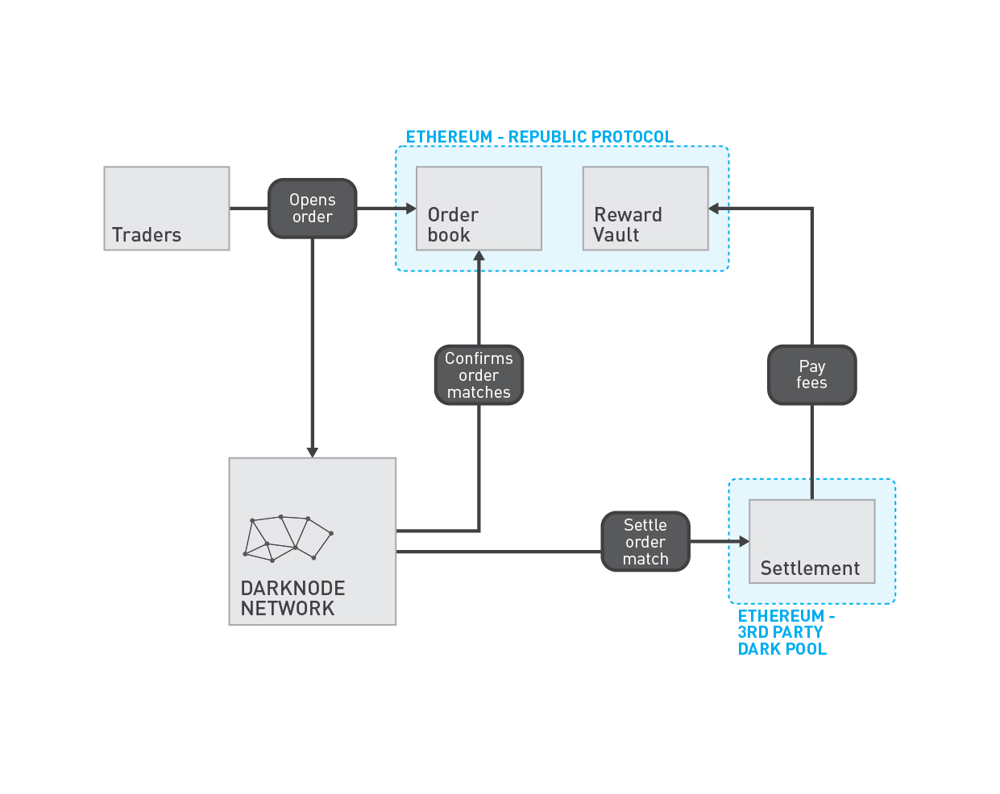

# Darknode Payments

There are two contracts used for paying off the darknodes: `DarknodePayment` and `DarknodePaymentStore`.

## `DarknodePayment` Contract

The `DarknodePayment` contract keeps track of the current payment cycle and the reward pool and reward share for the previous cycle.

Darknodes will mainly interact with the `DarknodePayment` contract for whitelisting and claiming rewards.

To claim rewards, the `claim()` function must be called. The first time it is called, it will whitelist the darknode to allow it to participate in cycle rewards. Future calls to `claim()` will allocate it the rewards for the previous cycle. These funds will be accumulated and can be withdrawn at anytime using the `withdraw()` function which will send all claimed rewards to the owner of the darknode.

The other main function is `changeCycle()` which can be called after the minimum cycle time has passed. The next time a cycle can be called is stored in the `cycleTimeout` variable.

`changeCycle()` performs the following actions:

* Snapshot the current token balances based off `shareSize` (the number of whitelisted darknodes last cycle). This will allocate a share of reward for each of the whitelisted darknodes from last cycle. Newly whitelisted darknodes will not get a share.
* Update the `currentCycle` and `previousCycle` variables.
* Updates the `shareSize` to the current number of whitelisted darknodes.
* Updates the list of registered tokens. Tokens pending registration will be registered and tokens pending deregistration will be deregistered.

A few of these actions such as handling snapshotting of balances and registration of tokens, involve iterating through a list of `registeredTokens`. Tokens can be registered by calling the `registerToken()` function. Tokens can be deregistered using `deregisterToken()`.

There is an incentive for people to call the `changeCycle()` function since darknodes need to be whitelisted for a least one full cycle before they can participate in rewards. So although calling `changeCycle()` isn't a requirement, there is still an incentive to do so.

When claiming rewards, the `unclaimedRewards` mapping stores the amount that has been allocated to whitelisted darknodes and can be claimed. `unclaimedRewards` will always be greater than the `previousCycleRewardShare`, and it will never be the case that we try to allocate a share to a darknode while `unclaimedRewards` is zero. This is because each whitelisted darknode is allocated one share, and darknodes cannot claim multiple times in one cycle. It can never be the case that all darknodes have claimed, and then someone else also claims (thus violating the invariant) since newly whitelisted darknodes cannot claim for that cycle.

### Permissions

The `blacklist()` function can only be called by `blacklister`. This is an address which has the ability to blacklist, defaults to the owner of the contract. The `blacklister` can be changed using the `updateBlacklister()`.

The `transferStoreOwnership()`, `claimStoreOwnership()`, `registerToken()`, `deregisterToken()`, `updateBlacklister()`, `updateCycleDuration()` functions can only be called by the owner of the contract.

All other functions are external functions callable by anyone.

## `DarknodePaymentStore` Contract

The `DarknodePaymentStore` handles the storage of the whitelist, blacklist, darknode balances, and storing of funds. Any funds transferred to `DarknodePayment` are forwarded to the `DarknodePaymentStore`. This allows the `DarknodePayment` contract to be scrapped without losing critical information.

The `DarknodePaymentStore` is a claimable contract whose owner should be the `DarknodePayment` contract.

The balances of darknodes can only ever be increased using the `incrementDarknodeBalance()` function. The balances will decrease only when the `transfer()` function is called. This will transfer a specified amount to the specified recipient, deducting the specified amount from the darknode balance.

## Interface

### Darknode operators

```ts
function changeCycle() returns (uint256);
function withdraw(address _darknode, address _token);
```

### Darknodes

```ts
function claim(address _darknode) onlyDarknode(_darknode) notBlacklisted(_darknode);
function blacklist(address _darknode) onlyBlacklister onlyDarknode(_darknode);
```

### Owner

```ts
function registerToken(address _token) onlyOwner;
function deregisterToken(address _token) onlyOwner;
function updateBlacklister(address _addr) onlyOwner;
function updateCycleDuration(uint256 _duration) onlyOwner;
function transferStoreOwnership(address _newOwner) onlyOwner;
function claimStoreOwnership() onlyOwner;
```

### Fee payees

There are two ways fees can be paid to the contract.

The first, and the one with lower fees, is to directly send the fees to the `DarknodePaymentStore` contract.

The second way is to call the `deposit` function on the `DarknodePayment` contract:

```ts
function deposit(uint256 _value, address _token) payable;
```


<!-- # Darknode Payment

After finding matching orders, confirming the match with the [Orderbook](./04-orderbook.md), and settling the match with the [Settlement Layer](./05-settlement.md), Darknodes are rewarded with a fee. This fee provides an economic incentive for the Darknodes to run the Secure Order Matcher on behalf of third-party dark pools. The Darknode Reward Vault is an Ethereum smart contract that collects these rewards and allows the Darknode operators to withdraw them. 



## Tokens

The tokens used to pay the fee is defined by the Settlement Layer. This provides third-party dark pools with the flexibility to pay fees in tokens that are not necessarily related to the cryptographic assets being traded due to regulation, or the fact that not all cryptographic assets can be sensibly used for paying fees (e.g. ERC721 tokens). Third-party dark pools that propose Settlement Layers with inappropriate tokens will not be accepted into the set of approved third-party dark pools.

## Amount

The amount of tokens paid as a fee is defined by the Settlement Layer. Third-party dark pools that propose Settlement Layers with inappropriate tokens will not be accepted into the set of approved third-party dark pools. This provides third-party dark pools with the opportunity to be competitive with their fees, not only in amount but also in structure. Settlement Layers may define fees as a flat rate, or as a percentage of the matching orders.

## Darknode Operators

Darknode operators are the Ethereum accounts used to register a Darknode in the [Darknode Registry](./01-darknode-registry.md). Fees earned by a Darknode are deposited into the Darknode Reward Vault and can be withdrawn by the respective Darknode operator. Any account can initiate the withdrawal, but the Darknode operator will always be the account that receives the funds.

***Important**: Deregistering a Darknode will prevent fees earned by the Darknode from being withdrawn. A Darknode operator must ensure that all fees have been withdrawn before deregistering a Darknode.* -->