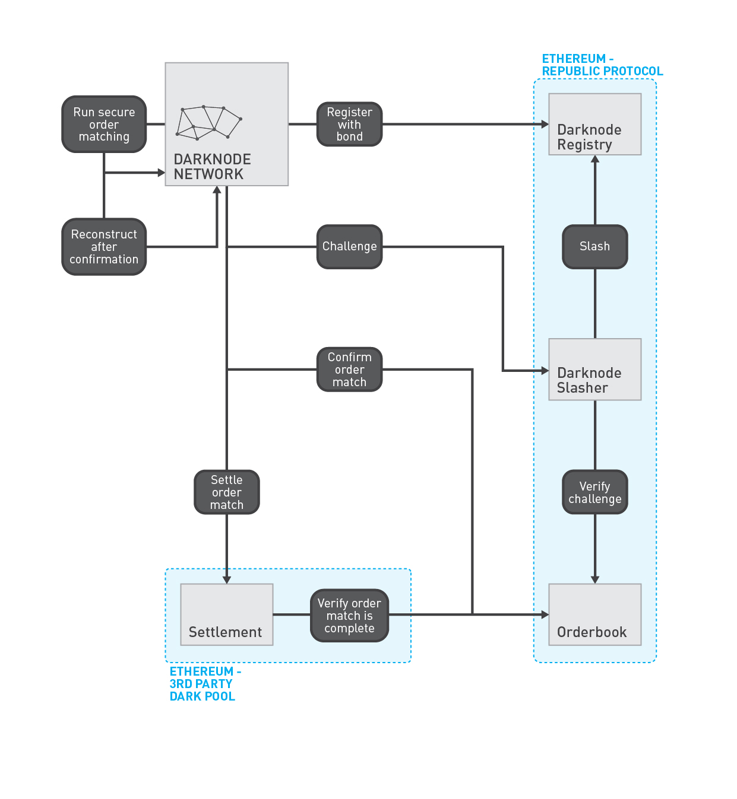

# Darknode Slasher

The Darknode Slasher is an Ethereum smart contract that discourages Darknodes from presenting false positives to the [Orderbook](./04-orderbook.md).

## Bonding

A bond of 100,000REN is required when registering a Darknode to the [Darknode Registry](./01-darknode-registry.md).

The Orderbook prevents an account from changing the state of an order to `Confirmed` unless the account is a registered Darknode Address. The Orderbook will also record the Darkode Address that was used to change the state of an order to `Confirmed`. By doing so, the Orderbook ensures that any account changing the state of an order to `Confirmed` has a bond at stake and can be punished if the confirmation is malicious.

## Malicious confirmations

A confirmation order match is considered malicious if, and only if, **any** of the following are **true**:

- The tokens of the two orders are not an exact match,
- the buy order has a price lower than the price of the sell order,
- the buy order has a volume lower than the minimum volume of the sell order, or
- the sell order has a volume lower than the minimum volume of the buy order.

## Challenging a malicious confirmation

Darknodes continuously observe the Orderbook for state changes to `Open` orders. This is done to prevent running the Secure Order Matcher on orders that have already been matched, but also to ensure that Darknodes reconstruct the price and volume of orders so that confirmed order matches can be settled — or challenged.

After reconstructing confirmed order matches, Darknodes usually send the reconstructed orders to the [Settlement Layer](./05-settlement.md). However, honest Darknodes will not attempt settlement if the reconstructed orders do not actually match (Settlement Layers are also required to reject settlement attempts for mismatching orders to protect against dishonest Darknodes). Instead, honest Darknodes will submit a challenge to the Darknode Slasher.

The Darknode Slasher will check that the challenged orders are in fact confirmed as matches in the Orderbook, and check the conditions required for a malicious confirmation. If, and only if, the confirmation is malicious, the bond of the Darknode Address that submitting the confirmation will be slashed in half and the Darknode Address will enter the *Pending Deregistration* state. The Darknode that submitted the challenge pays for all of the gas fees, but is rewarded with half of the slashed bond (i.e. one quarter of the total bond).



The Darknode Slasher ABI is almost identical to the [Settlement ABI](./05-settlement.md). For confirmed order matches, Darknodes will always either (a) submit a challenge, or (b) submit a settlement. The information available to the Darknode at both stages is identical.

### Submitting orders for a challenge

```sol
function submitOrder(bytes _order, uint64 _settlement, uint64 _tokens, uint256 _price, uint256 _volume, uint256 _minVolume) { /* ... */ }
```

### Executing a challenge

```sol
function challenge(bytes32 _buy, bytes32 _sell) { /* ... */ }
```